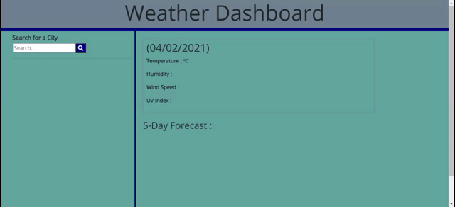

# WeatherDashboard
06 Server-Side APIs: Weather Dashboard

This application uses the [OpenWeather API](https://openweathermap.org/api) to retrieve weather data for cities. The `localStorage` is used to store any persistent data.

## User Story

```
AS A traveler
A user WANT to see the weather outlook for multiple cities
SO THAT he/she can plan a trip accordingly
```

## Criteria

```
GIVEN a weather dashboard with form inputs
WHEN a user search for a city
THEN he/she is presented with the current and future conditions for that city and that city is added to the search history
WHEN he/she view current weather conditions for that city
THEN the user is presented with the city name, the date, an icon representation of weather conditions, the temperature, the humidity, the wind speed, and the UV index
WHEN the user view the UV index
THEN he/she is presented with a color that indicates whether the conditions are favorable, moderate, or severe
WHEN the user view future weather conditions for that city
THEN he/she is presented with a 5-day forecast that displays the date, an icon representation of weather conditions, the temperature, and the humidity
WHEN the user click on a city in the search history
THEN he/she is again presented with current and future conditions for that city
```

## Mock-Up

The following image shows the web application's appearance and functionality:



## Review

* The URL of the deployed application : https://zahid267.github.io/WeatherDashboard/

* The URL of the GitHub repository : https://github.com/zahid267/WeatherDashboard

- - -
*** Developed by Muhammad Zahid --- April 02, 2021